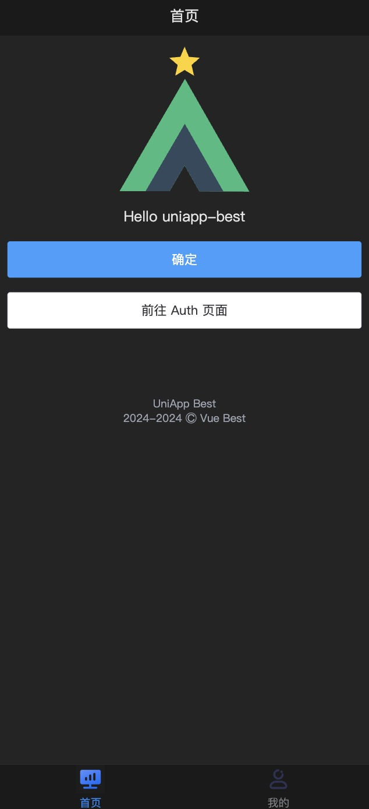
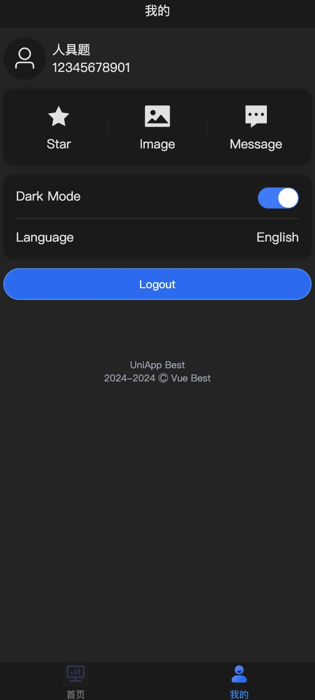

# uniapp-best

现代化的 Uniapp 开发模板。

使用 vue3 开发，已配置好**多语言**、**主题切换**等特色功能。

## 运行

> 环境要求： node >= 18.14.2 pnpm >=9.1.4

```bash
# 克隆项目
git clone https://github.com/wjc-1996/uniapp-best.git

# 安装依赖
pnpm install

# 启动h5开发环境
pnpm dev:h5
```

效果图：

<div style="display: flex; grid-gap: 8px;">


</div>


## 技术栈

uniapp + vue3 + wot design uni + vite5 + pinia + typescript + unocss + sass

## 功能

- [x] 布局设置
- [x] 基础组件
- [x] 多语言
- [x] 主题切换
- [x] 路由拦截
- [x] 权限管理
- [x] 请求拦截
- [x] 状态管理
- [x] 状态持久化
- [x] 网络请求
- [x] 预设图标
- [x] 代码检查
- [x] 支持分包
- [x] 小程序开发
- [x] 自定义tabbar
- [ ] 检查升级

### 布局设置

uniapp-best 使用 [@uni-helper/vite-plugin-uni-layouts](https://github.com/uni-helper/vite-plugin-uni-layouts) 实现全局的布局组件，`src/layouts/default.vue` 是默认的布局，该布局实现了一些基础页面功能，比如内容边距和页脚等。

在添加页面时，页面默认是被包裹在 `default.vue` 布局中，也可以不使用布局，或者自定义新的布局。

1. 使用默认布局

默认使用 `default.vue` 布局，无需指定 `layout` 字段。

```json
"pages": [
		{
			"path": "pages/splash/index",
			"style": {
				"navigationStyle": "custom"
			}
		},
]
```

2. 不使用默认布局

将 `layout` 字段设置为 `false` 即可。

```json
"pages": [
		{
			"path": "pages/splash/index",
      "layout": false,
			"style": {
				"navigationStyle": "custom"
			}
		},
]
```

3. 使用自定义布局

> 注意：不要修改 src/layouts 目录名称

在 `src/layouts` 目录下新建一个布局文件，比如 `new.vue`，你可以自由的在这个文件中添加你所需要的内容，需要注意的是不用忘记设置一个默认插槽来放置你的页面。

```vue
<template>
  <view class="new-layout">
      <slot></slot>
</template>

<script setup lang="ts">

</script>

<style scoped lang="scss">
  .new-layout {
  }
</style>
```

### 基础组件

uniapp-best 提供了一些基础组件，使用时无需引入，直接使用即可，你可以使用首字母大写驼峰或者字母小写连字符的方式引用。

```vue
  <template>
    <MCard></MCard>
    <m-card></m-card>
  </template>
```

- MConfigProvider

全局的系统配置组件，每个页面都会插入在该组件下，借助 `pinia` 和 `page-meta` 用于切换主题后同步每个页面的主题设置。

需要自定义深色主题和亮色主题下的导航条颜色，可在该组件内设置。

> 通过自定义的 vite 插件 vite-plugin-uni-provider 来实现，插件位于 build 目录下

- MSafeAreaTop

用于设置顶部安全区域

- MCard

卡片布局组件，将内容包裹在卡片样式中，可以通过 `space` 属性来实现 flex 布局的间距效果和分隔符。

- MContent

布局组件，用于包裹页面内容，可以设置页面的背景色，方便用于统一整个应用的页面布局。

- MFooter

页脚组件。

- MIcon

svg 图标组件，
通过 `name` 属性来指定图标名称，图标放置在 `src/assets/icons` 目录下，你可以通过 `svg` 格式来添加自定义图标。

- MNavbar

导航栏组件，用于显示导航栏。

- MTabbar

标签栏组件，用于显示标签栏。

### husky 配置说明

安装 husky

> nodejs >= 18

```bash
pnpm add husky@8.0.3 -D
```

配置 package.json

配置该脚本后，install 后会自动执行该命令

```json
script : { "prepare": "husky install" }
```

添加 git 钩子

```bash
npx husky add .husky/pre-commit "pnpm pre-commit"
```

安装 lint-staged

用于只检查暂存区的文件

```bash
pnpm add lint-staged -D
```

配置 lint-staged

```json
  "lint-staged": {
    "*.{vue,js,ts,jsx,tsx}": [
      "pnpm format",
      "pnpm lint"
    ],
    "*.{css,scss,vue,html}": [
      "pnpm format",
      "pnpm lint:style"
    ]
  }
```

安装 eslint 和配置

配置 lint 脚本命令

添加 husky commit 钩子

```bash
npx husky add .husky/pre-commit "npm run lint"
```

安装和配置 commitlint

添加 husky commit type校验 钩子

```bash
npx husky add .husky/commit-msg "npx --no-install commitlint --edit $HUSKY_GIT_PARAMS"
```

问题1： husky 不生效？

> 找到项目的.git 文件，查看是否有hooks目录及文件，没有的话，手动安装husky；如有hooks目录，尝试删除该目录后卸载husky后重新安装，重新设置husky钩子函数
